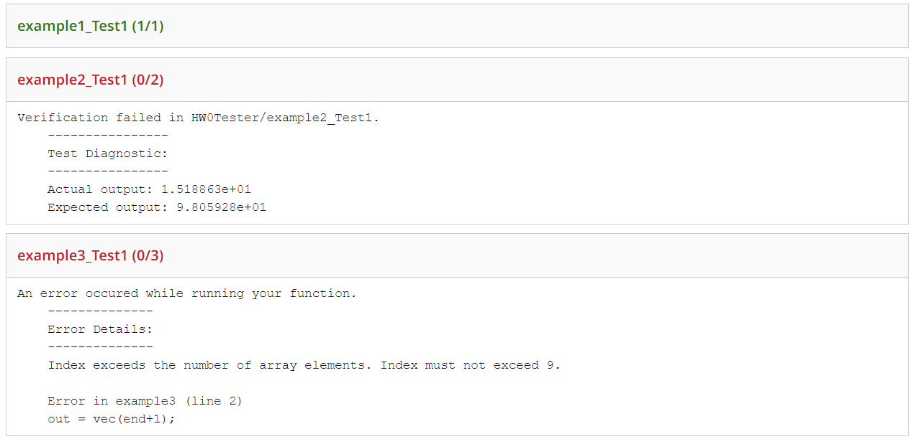

# CS1371-autograder
The *new* Gradescope autograder for CS1371.
## Install instructions
Currently, the Docker is hosted by me at ekim493/cs1371-autograder. To follow these instructions on your own, create a Docker hub account, then create your own Docker hub repository. Then, replace all instances of ekim493/cs1371-autograder with the name of your repository.
These instructions are only tested for Windows.
- Download the Docker engine and log in.
- Open the terminal and navigate to the directory with the Dockerfile.
- Type `docker build ./ -t ekim493/cs1371-autograder` followed by `docker run --rm -it -v /source/submit:/autograder/submission -v /source:/autograder/results ekim493/cs1371-autograder:latest bash`.
- You should now be in the Docker container, and the terminal should say something like root@123123.
- Run Matlab by typing `matlab -licmode onlinelicensing`. You will then be prompted to enter your email.
- It will then prompt you for a one time password by following a link to the Mathworks website.
- Enter the password and Matlab should start.
- Open a new terminal while the previous one is running, and type `docker commit CONTAINER_NAME ekim493/cs1371-autograder:latest`
    - Replace CONATINER_NAME with the name of the current container. This can be found in the Docker desktop app.
    - **Ensure you are logged in**
- Finally, push the image to the web using `docker push ekim493/cs1371-autograder`.
- In gradescope, go to 'Configure Autograder', select 'Manual Docker configuration', and then type in the docker image name. `ekim493/cs1371-autograder:latest` in this case.
## Stucture
`Dockerfile` is the file used to build our Docker environment
- Update the Dockerfile if the Matlab version changes.

`source` holds all relevant data necessary to run the autograder
- `source/runTester.m` is the main Matlab driver to run the test cases and output the results as a results.json.
- `source/solutions` holds the solution codes for all HW assignments. 
    - All assignments should be organized into folders where the name of the folder is the same as the gradescope assignment.
    - All solutions codes should be name `FUNCTION_soln.m`, where `FUNCTION` is replaced with the name of the function.
- `source/testers` holds the test suites & scoring rubrics for all HW assignments. 
    - The name of the tester should be the the gradescope assignment name + 'Tester.m'.
    - The name of the scoring rubrics should be a JSON with the name being the assignment + 'Scores.json'.
    - Example: For a gradescope assignment called `HW0`, the testers file should contain a `HW0Tester.m` and a `HW0Scores.json`.
## Gradescope view
What the current gradescope autograder view looks like:

